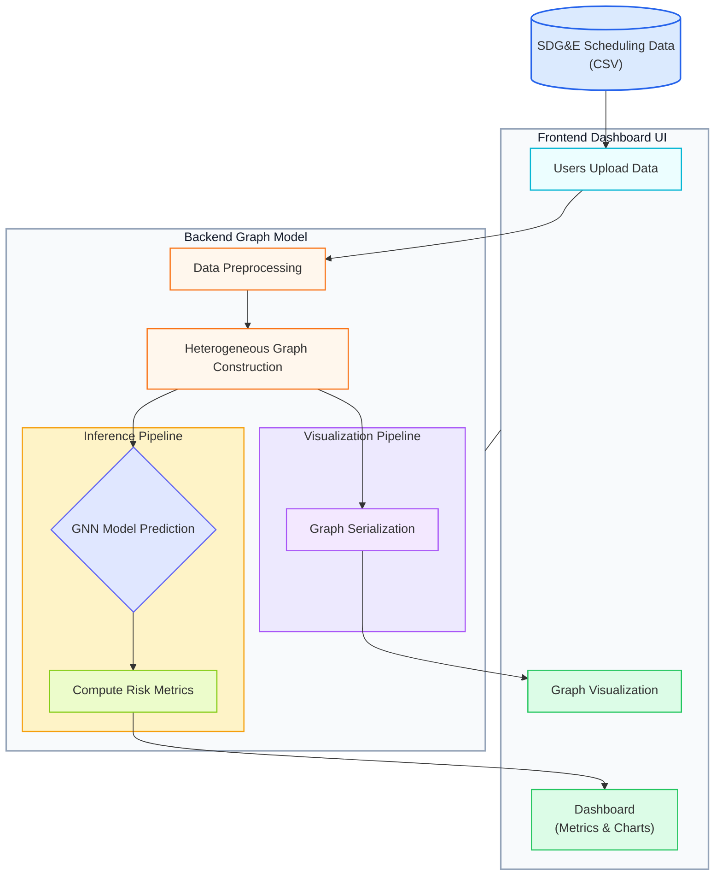

```mermaid
flowchart
LEFT_ANCHOR:::hidden
RIGHT_ANCHOR:::hidden

%% =========================
%% INPUT
%% =========================
INPUT[("SDG&E Scheduling Data<br/>(CSV)")]

%% =========================
%% FRONTEND
%% =========================
subgraph FE["Frontend Dashboard UI  <br/><span style='font-size:13px'>(Next.js + React + TypeScript)</span>"]
direction TB
FE1["Users Upload Data"]
FE2["Dashboard <br/> (Metrics & Charts)"]
FE3["Graph Visualization"]
end

%% =========================
%% BACKEND
%% =========================
subgraph BE["Backend Graph Model<br/><span style='font-size:13px'>(FastAPI + PyTorch)</span>"]
direction TB

B1["Data Preprocessing"]
B2["Heterogeneous Graph Construction"]

subgraph BRANCH1["Inference Pipeline"]
direction TB
B3{"GNN Model Prediction"}
B4["Compute Risk Metrics"]
end

subgraph BRANCH2["Visualization Pipeline"]
direction TB
B5["Graph Serialization"]
end

end

%% =========================
%% FLOW
%% =========================
INPUT --> FE1
FE1 --> B1

B1 --> B2

B2 --> B3
B2 --> B5

B3 --> B4

B4 --> FE2
B5 --> FE3

%% force layout ordering
FE --- BE

%% =========================
%% STYLING
%% =========================
classDef hidden display:none;

style INPUT fill:#dbeafe,stroke:#2563eb,stroke-width:2px

style FE fill:#f8fafc,stroke:#94a3b8,stroke-width:2px,color:#111827
style BE fill:#f8fafc,stroke:#94a3b8,stroke-width:2px,color:#111827

style BRANCH1 fill:#fef3c7,stroke:#f59e0b,stroke-width:1.5px
style BRANCH2 fill:#ede9fe,stroke:#a855f7,stroke-width:1.5px

style FE1 fill:#ecfeff,stroke:#06b6d4,stroke-width:1.5px
style FE2 fill:#dcfce7,stroke:#22c55e,stroke-width:1.5px
style FE3 fill:#dcfce7,stroke:#22c55e,stroke-width:1.5px

style B1 fill:#fff7ed,stroke:#f97316,stroke-width:1.5px
style B2 fill:#fff7ed,stroke:#f97316,stroke-width:1.5px
style B3 fill:#e0e7ff,stroke:#6366f1,stroke-width:1.5px
style B4 fill:#ecfccb,stroke:#84cc16,stroke-width:1.5px
style B5 fill:#f3e8ff,stroke:#a855f7,stroke-width:1.5px
```
