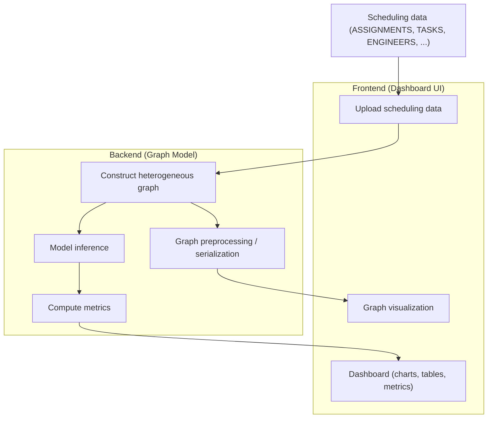

```mermaid
flowchart

  %% Raw external data
  RAW["Scheduling data (ASSIGNMENTS, TASKS, ENGINEERS, ...)"]

  %% Frontend
  subgraph FRONTEND["Frontend (Dashboard UI)"]
    UPLOAD["Upload scheduling data"]
    DASH["Dashboard (charts, tables, metrics)"]
    GRAPHVIZ["Graph visualization"]
  end

  %% Backend
  subgraph BACKEND["Backend (Graph Model)"]
    BUILD["Construct heterogeneous graph"]
    INFER["Model inference"]
    METRICS["Compute metrics"]
    SERIALIZE["Graph preprocessing / serialization"]
  end

  %% Flow
  RAW --> UPLOAD
  UPLOAD --> BUILD
  BUILD --> INFER
  INFER --> METRICS
  METRICS --> DASH
  BUILD --> SERIALIZE
  SERIALIZE --> GRAPHVIZ
```
